# Seva Mein Funds - NGO Crowdfunding Platform


Seva Mein Funds is a comprehensive crowdfunding platform designed to empower Non-Governmental Organizations (NGOs) by enhancing their reach and fundraising capabilities. This platform enables multiple NGOs to create profiles, launch fundraising campaigns, and promote their initiatives to a wider audience.

## Table of Contents

- [Project Goals](#project-goals)
- [Features](#features)
- [Tech Stack](#tech-stack)
- [Getting Started](#getting-started)
  - [Prerequisites](#prerequisites)
  - [Installation](#installation)
- [Usage](#usage)
- [API Documentation](#api-documentation)
- [Raising Issues](#raising-issues)
- [Contributing](#contributing)
- [License](#license)
- [Contact](#contact)

## Project Goals

Seva Mein Funds aims to:

1. Provide a user-friendly platform for NGOs to showcase their work and raise funds efficiently.
2. Increase transparency in the fundraising process for donors and NGOs.
3. Facilitate easier discovery of worthy causes for potential donors.
4. Streamline the donation process with secure and seamless transactions.
5. Offer valuable insights and analytics to NGOs for better campaign management.
6. Foster a community of socially conscious individuals and organizations.
7. Amplify the impact of NGOs by expanding their reach and resources.

## Features

- **NGO Profiles**: Organizations can create and manage detailed profiles showcasing their mission, projects, and impact.
- **Fundraising Campaigns**: Easy-to-use tools for NGOs to create and manage multiple fundraising campaigns.
- **Secure Donations**: Integrated payment gateway (Razorpay) for secure and seamless donations.
- **Media Management**: Cloudinary integration for efficient storage and delivery of images and videos.
- **Email Notifications**: Automated email updates to donors and NGOs using Nodemailer.
- **Responsive Design**: Mobile-friendly interface ensuring accessibility across devices.
- **Analytics Dashboard**: Insights and statistics for NGOs to track their fundraising progress.

## Tech Stack

- **Frontend**: React.js
- **Backend**: Node.js, Express.js
- **Database**: MongoDB
- **State Management**: Redux
- **Payment Integration**: Razorpay
- **Email Service**: Nodemailer
- **Media Storage**: Cloudinary
- **Authentication**: JSON Web Tokens (JWT)

## Getting Started

### Prerequisites

- Node.js (v14.0.0 or later)
- MongoDB
- npm or yarn

### Installation

1. Clone the repository:
   ```bash
   git clone https://github.com/Shivansh-0403/seva-mein-funds.git
   cd seva-mein-funds
   ```

2. Install dependencies for both client and server:
   ```bash
   cd client && npm install
   cd ../server && npm install
   ```

3. Set up environment variables:
   Create a `.env` file in the server directory and add the following:
   ```bash
   CORS_ORIGIN=your_client_url
   PORT=your_port_number

   TOKEN_SECRET=your_jwt_secret
   
   MONGODB_URI=your_mongodb_connection_string
   
   ACCESS_TOKEN_SECRET=your_access_token_secret
   ACCESS_TOKEN_EXPIRY=your_access_token_expiry
   
   REFRESH_TOKEN_SECRET=your_refresh_token_secret
   REFRESH_TOKEN_EXPIRY=your_refresh_token_expiry
   
   USER_EMAIL=your_email_for_nodemailer
   USER_PASSWORD=your_email_password_for_nodemailer
   CLOUDINARY_CLOUD_NAME=your_cloudinary_cloud_name
   CLOUDINARY_API_KEY=your_cloudinary_api_key
   CLOUDINARY_API_SECRET=your_cloudinary_api_secret
   
   RAZORPAY_KEY_ID=your_razorpay_key_id
   RAZORPAY_KEY_SECRET=your_razorpay_key_secret
   ```

4. Start the development servers:
   In the server directory:
   ```bash
   npm run dev
   ```
   In the client directory:
   ```bash
   npm run dev
   ```

## Usage

[Provide instructions on how to use the platform, including how NGOs can register, create campaigns, and how donors can contribute]

## API Documentation

[Link to or provide details about your API endpoints, request/response formats, and authentication requirements]

## Raising Issues

We use GitHub Issues to track bugs, feature requests, and other project-related tasks. Before raising an issue, please check if a similar issue already exists. If not, follow the process outlined in the diagram below:





When raising an issue:
1. Use a clear and descriptive title
2. Provide a detailed description of the issue or feature request
3. Include steps to reproduce (for bugs)
4. Add screenshots or code snippets if applicable
5. Label the issue appropriately (e.g., bug, enhancement, documentation)

## Contributing

We welcome contributions to Seva Mein Funds! Please read our [Contributing Guidelines](CONTRIBUTING.md) for details on our code of conduct, development process, and how to submit pull requests.

## License

This project is licensed under the MIT License - see the [LICENSE](LICENSE) file for details.

## Contact

[Your Name/Team Name] - [your.email@example.com]

Project Link: [https://github.com/Shivansh-0403/seva-mein-funds](https://github.com/Shivansh-0403/seva-mein-funds)

---

Made with ❤️ for NGOs and social impact